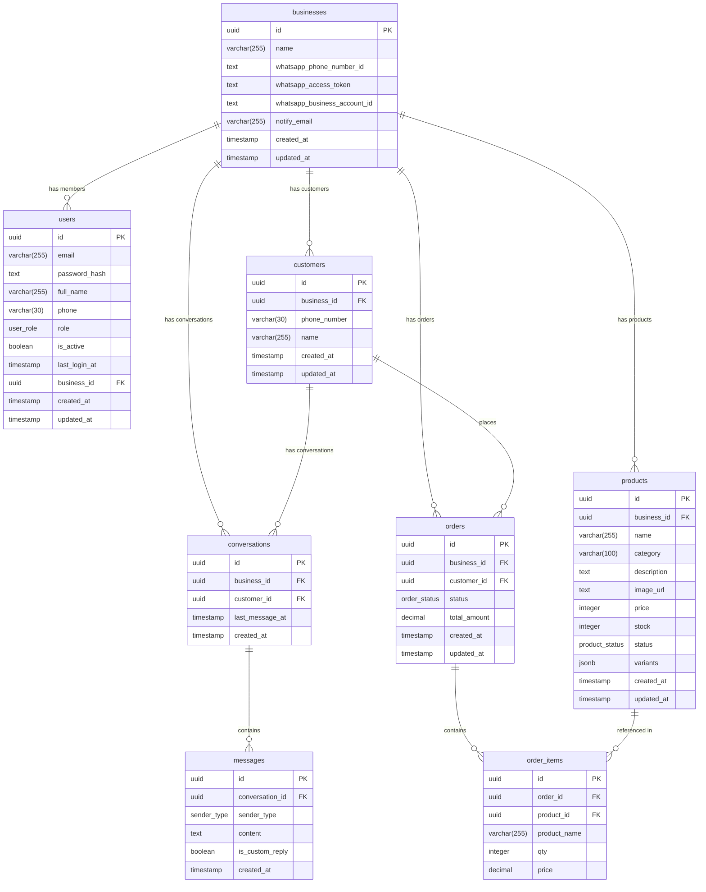

## Enums

### user_role
| Value              | Description                                      |
|--------------------|--------------------------------------------------|
| `crm_owner`        | Platform owner — full access across all businesses |
| `business_admin`   | Client who signs up — manages their own business |
| `business_employee`| Agent under a business — restricted access       |

### sender_type
| Value      |
|------------|
| customer   |
| ai         |
| agent      |

### order_status
| Value       |
|-------------|
| new         |
| confirmed   |
| dispatched  |
| delivered   |

### product_status
| Value        |
|--------------|
| active       |
| out_of_stock |

## ProductVariants (JSONB)
```ts
{
  colors?:  string[]
  sizes?:   string[]
  storage?: string[]
}
```

## Permission Matrix

| Action                          | crm_owner | business_admin | business_employee |
|---------------------------------|-----------|----------------|-------------------|
| View all businesses (dashboard) | ✅        | ❌             | ❌                |
| Add/remove CRM owners           | ✅        | ❌             | ❌                |
| Manage own business settings    | ✅        | ✅             | ❌                |
| Add/remove team members         | ✅        | ✅             | ❌                |
| Create/edit products            | ✅        | ✅             | ✅                |
| Delete products                 | ✅        | ✅             | ❌                |
| View/send messages              | ✅        | ✅             | ✅                |
| View orders                     | ✅        | ✅             | ✅                |
| Update order status             | ✅        | ✅             | ✅                |
| View customers & analytics      | ✅        | ✅             | ✅                |

## API Routes

| Method | Path                              | Role Required                        |
|--------|-----------------------------------|--------------------------------------|
| POST   | /api/auth/login                   | —                                    |
| POST   | /api/auth/register                | —                                    |
| GET    | /api/auth/me                      | any authenticated                    |
| GET    | /api/products                     | any authenticated                    |
| POST   | /api/products                     | crm_owner, business_admin, b_employee|
| PATCH  | /api/products/:id                 | crm_owner, business_admin, b_employee|
| DELETE | /api/products/:id                 | crm_owner, business_admin            |
| GET    | /api/customers                    | crm_owner, business_admin, b_employee|
| GET    | /api/customers/analytics          | crm_owner, business_admin, b_employee|
| GET    | /api/customers/:id                | crm_owner, business_admin, b_employee|
| GET    | /api/conversations                | crm_owner, business_admin, b_employee|
| GET    | /api/conversations/:id/messages   | crm_owner, business_admin, b_employee|
| POST   | /api/conversations/:id/messages   | crm_owner, business_admin, b_employee|
| GET    | /api/orders?status=               | crm_owner, business_admin, b_employee|
| GET    | /api/orders/:id                   | crm_owner, business_admin, b_employee|
| PATCH  | /api/orders/:id/status            | crm_owner, business_admin, b_employee|
| GET    | /api/team                         | crm_owner, business_admin            |
| POST   | /api/team                         | crm_owner, business_admin            |
| DELETE | /api/team/:id                     | crm_owner, business_admin            |
| GET    | /api/businesses                   | crm_owner                            |
| GET    | /api/businesses/settings          | crm_owner, business_admin            |
| PATCH  | /api/businesses/settings          | crm_owner, business_admin            |
| GET    | /api/crm-owner/stats              | crm_owner                            |
| GET    | /api/crm-owner/businesses         | crm_owner                            |
| GET    | /api/crm-owner/owners             | crm_owner                            |
| POST   | /api/crm-owner/owners             | crm_owner                            |
| DELETE | /api/crm-owner/owners/:id         | crm_owner                            |
